# Lab2Web
## Kerangka Html
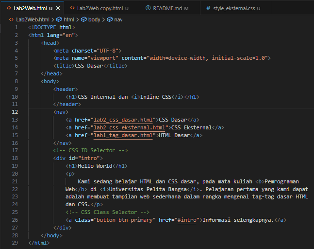

## Menambahkan CSS langsung di html
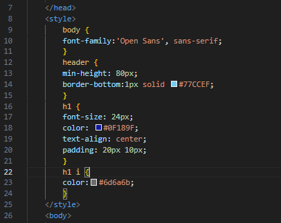

* Tempatkan di bawah &lt;/head&gt; di atas &lt;body&gt;, CSS di gunakan untuk membuat tampilan/tataletak.

### Hasil Tampilan 

* Sebelum dan sesudah ditambahkan.

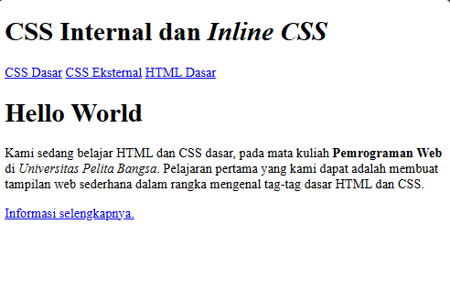 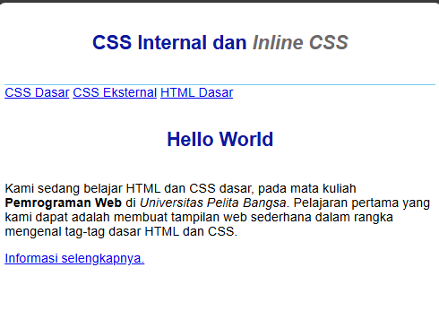

## Menambahkan Style/CSS di dalam &lt;p&gt; untuk tampilan warna dan tataletak 
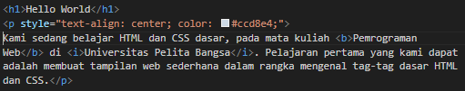

### Hasil Tampilan dari Paragraf teks berubah jadi center dan color white blue
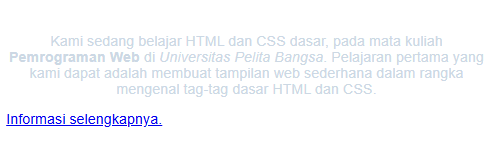

## Menambahkan Style/CSS langsung di CSS untuk mengatur &lt;nav&gt;
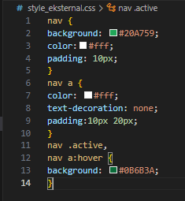

* Lalu untuk agar berfungsi ke html nya tambahkan lokasi CSS nya di html.

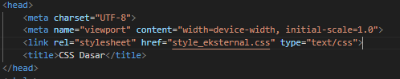

* Bagian dalam &lt;link&gt;/Href yang berisi lokasi/nama CSS nya (href="style_eksternal.css") dan Tempatkan di dalam &lt;head&gt;.

### Hasil Tampilan bagian &lt;nav&gt; berubah
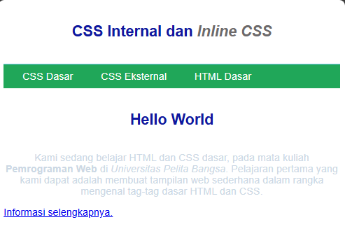

## Menambahkan CSS Selector di file CSS (style_eksternal.css)
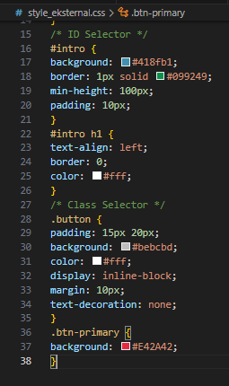

* CSS yang digunakan kalau menggunakan (Id="") yang biasa di gunakan untuk logika di JavaScript yang di masukan ke html dan bisa juga di gunakan di CSS dengan menggunakan awalan "#" dan hanya bisa satu element, berbeda dengan kalau menggunakan (Class="") yang awalannya "." bisa di gunakan lebih.

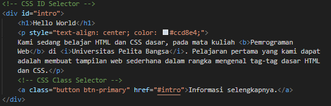

* Ini untuk mengubah tampilan background/box dari &lt;nav&gt; dan style untuk button.

### Hasil tampilan bagian background &lt;nav&gt; dan style button "Information Selengkapnya".
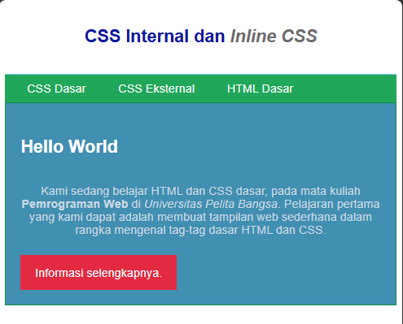

# Pertanyaan dan Tugas
1. Lakukan eksperimen dengan mengubah dan menambah properti dan nilai pada kode CSS
dengan mengacu pada CSS Cheat Sheet yang diberikan pada file terpisah dari modul ini.
*  Melakukan Sedikit Modifikasi bagian CSS Style.

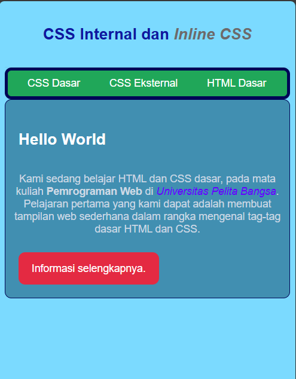

2. Apa perbedaan pendeklarasian CSS elemen h1 {...} dengan #intro h1 {...}? berikan
penjelasannya!
* h1 {...} adalah selector elemen. Semua yang menggunakan &lt;h1&gt; di halaman akan terkena CSS ini, tanpa melihat di mana &lt;h1&gt; itu berada.
    * Contoh: 
    
    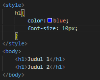 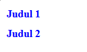

    * Semua yang menggunakan &lt;h1&gt; akan terpengaruh.

* #intro h1 {...} adalah selector kombinasi ID dan elemen. Hanya &lt;h1&gt; yang kalau berada di dalam elemen dengan ID intro yang akan terkena CSS sedangkan yang di luar &lt;div&gt;/Id tidak akan terpengaruh.
    * Contoh:

    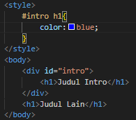 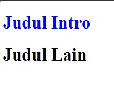

3. Apabila ada deklarasi CSS secara internal, lalu ditambahkan CSS eksternal dan inline CSS pada
elemen yang sama. Deklarasi manakah yang akan ditampilkan pada browser? Berikan
penjelasan dan contohnya!
* Browser akan menggunakan CSS prioritas: Inline = paling tinggi prioritas, Internal = menengah, External = paling rendah
    * Contoh:

    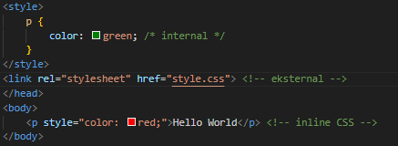 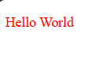

    * Karena Inline langsung berada di dalam selector &lt;p&gt; sehingga akan di utamakan.

4. Pada sebuah elemen HTML terdapat ID dan Class, apabila masing-masing selector tersebut
terdapat deklarasi CSS, maka deklarasi manakah yang akan ditampilkan pada browser?
Berikan penjelasan dan contohnya! ( &lt;p id="paragraf-1" class="text-paragraf" &gt; )
* Kalau elemen memiliki ID dan class, dan keduanya memiliki CSS, maka ID memiliki prioritas lebih tinggi daripada class karena specificity ID lebih tinggi.
    * Contoh:

    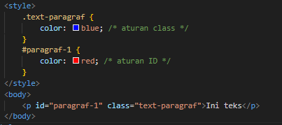 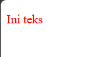

    * Dan id lebih tinggi dibandingkan class dan id lebih rendah di bandingkan inline, karena inline tetap paling tinggi specificity nya.